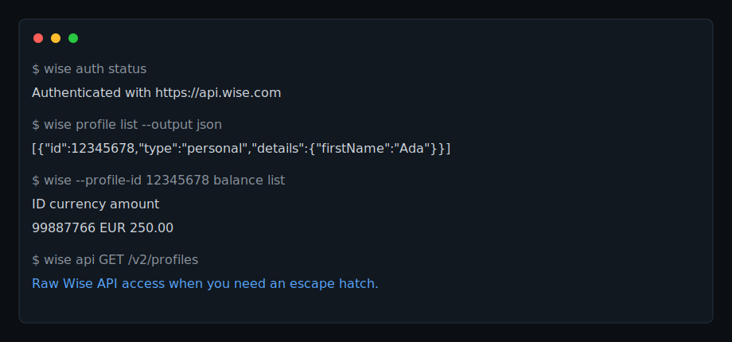

# wise-cli

[](https://www.npmjs.com/package/@brahimhamichan/wise-cli)
[](https://github.com/brahimhamichan/wise-cli/actions/workflows/ci.yml)
[](LICENSE)
[](package.json)
[](https://skills.sh/brahimhamichan/wise-cli)

Use the Wise Platform API from your terminal.

`wise-cli` is an unofficial TypeScript CLI for the current Wise Platform API. It wraps profile, balance, recipient, quote, transfer, statement, and currency endpoints behind one command surface while leaving a raw `wise api` escape hatch for newly released endpoints.



This first public release is intentionally conservative:

- It is built around the currently documented Wise production and sandbox APIs.
- It supports personal-token auth out of the box.
- It keeps dynamic payloads as JSON bodies so the CLI stays compatible with Wise's mixed endpoint versions and changing requirements.
- It is not affiliated with, endorsed by, or maintained by Wise.

## Why use it?

- Avoid memorizing Wise's mixed API endpoint versions for common workflows.
- Automate Wise API tasks from scripts, CI jobs, and agent workflows.
- Keep using newly released or specialized endpoints through `wise api`.

## Install

The GitHub repo is public as `brahimhamichan/wise-cli`. The npm package is scoped because the unscoped `wise-cli` name is already taken on npm.

```bash
npm install -g @brahimhamichan/wise-cli
```

Or run it directly from the repo:

```bash
npm install
npm run build
node ./bin/run.js --help
```

## Authenticate

Generate a personal token in Wise:

`Your Account > Integrations and tools > API tokens > Add new token`

Store it locally:

```bash
wise auth login --token "$WISE_TOKEN"
wise auth status
```

Or use environment variables for stateless runs:

```bash
export WISE_TOKEN="..."
export WISE_PROFILE_ID="12345678"
```

Supported environment variables:

- `WISE_TOKEN` or `WISE_API_TOKEN`
- `WISE_PROFILE_ID`
- `WISE_BASE_URL`
- `WISE_TIMEOUT_MS`
- `WISE_OUTPUT`

The local config file lives at `~/.config/wise-cli/config.json` and is written with `0600` permissions.

## Important limits

Wise's current docs matter here:

- Base URLs are `https://api.wise.com` and `https://api.wise-sandbox.com`.
- Endpoint versions are mixed by resource. This CLI hides that internally.
- Personal tokens have limits. In the EU/UK they cannot fund transfers or view balance statements via API.
- SCA and Wise approval settings can still block valid transfer requests.

If you need something newly added or more specialized, use `wise api`.

## Commands

```text
wise auth login|status|logout
wise profile list|show
wise balance list|show|create|close
wise currency list
wise recipient list|show|create|delete|requirements
wise quote preview|create|show|update
wise transfer list|show|requirements|create|fund|payments|cancel|receipt
wise statement get
wise api <method> <path>
```

## Examples

List profiles:

```bash
wise profile list --output json
```

List balances for the configured profile:

```bash
wise --profile-id 12345678 balance list
```

Create a quote from a JSON file:

```bash
wise --profile-id 12345678 quote create --body @examples/quote.json
```

Check recipient requirements for a quote:

```bash
wise recipient requirements 987654321
```

Create a transfer:

```bash
wise transfer create --body @examples/transfer.json
```

Download a PDF receipt:

```bash
wise transfer receipt 123456789 --out ./receipt.pdf
```

Download a JSON statement:

```bash
wise --profile-id 12345678 statement get 99887766 \
  --currency EUR \
  --start 2025-03-01T00:00:00.000Z \
  --end 2025-03-31T23:59:59.999Z \
  --format json
```

Raw API escape hatch:

```bash
wise api GET /v2/profiles
wise api POST /v1/transfers --body @transfer.json
```

More copy-paste workflows:

- [Export a Wise balance statement as JSON](docs/recipes/export-balance-statement.md)
- [Create a Wise quote from a JSON file](docs/recipes/create-quote.md)
- [Download a Wise transfer receipt as PDF](docs/recipes/download-transfer-receipt.md)

## Skill

The repo also ships a Codex skill at `skills/wise-api-cli/` so the same repository can be used as both a CLI and a reusable agent skill for Wise API automation.

Install the skill directly from GitHub:

```bash
npx skills add https://github.com/brahimhamichan/wise-cli --skill wise-api-cli
```

`skills.sh` indexing is telemetry-based from `skills add` installs, so discovery can lag until at least one telemetry-enabled install has been recorded and the skills.sh cache refreshes.

## Roadmap

- Webhook helper commands for event-driven Wise automation.
- Batch transfer and batch quote workflows.
- Shell completions for common command flags.
- Interactive auth and profile selection.
- Additional statement formats and export helpers.

## Development

```bash
npm install
npm run build
npm test
npm run pack:check
```

## Sources

The current implementation and references were aligned against Wise's public docs:

- [Getting started](https://docs.wise.com/guides/developer)
- [Security and access](https://docs.wise.com/guides/developer/auth-and-security)
- [API reference overview](https://docs.wise.com/api-reference)
- [Versioning](https://docs.wise.com/api-docs/api-reference/versioning)
- [Profile](https://docs.wise.com/api-reference/profile/profile)
- [Balance](https://docs.wise.com/api-reference/balance)
- [Recipient](https://docs.wise.com/api-reference/recipient)
- [Quote](https://docs.wise.com/api-reference/quote)
- [Transfer](https://docs.wise.com/api-reference/transfer)
- [Balance statement](https://docs.wise.com/api-reference/balance-statement)
